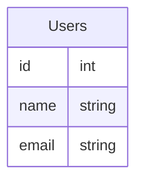
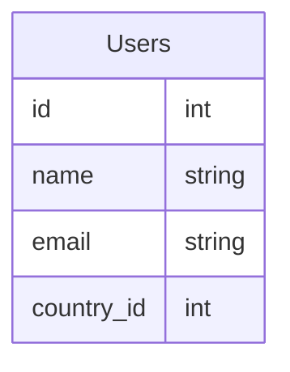

# Notas sobre los modelos y sus migraciones

- [Notas sobre los modelos y sus migraciones](#notas-sobre-los-modelos-y-sus-migraciones)
  - [Conceptos](#conceptos)
    - [Modelo](#modelo)
    - [Migration](#migration)
  - [Notas](#notas)
    - [I. Creación de modelos](#i-creación-de-modelos)
    - [II. Aplicación de modelos y actualización a esquema de base de datos](#ii-aplicación-de-modelos-y-actualización-a-esquema-de-base-de-datos)
    - [III. No puedes modificar un modelo y pedirle a Sequelize que te genere la migración correspondiente automáticamente](#iii-no-puedes-modificar-un-modelo-y-pedirle-a-sequelize-que-te-genere-la-migración-correspondiente-automáticamente)
    - [Aplicar migraciones en la base de datos](#aplicar-migraciones-en-la-base-de-datos)
    - [Deshacer cambios hechos por una migración](#deshacer-cambios-hechos-por-una-migración)


## Conceptos

### Modelo
Abstracción de una tabla de la base de datos. Sequelize define a cada tabla en tu base de datos como un "modelo". Por tanto, los modelos son:
  
  a. Objetos de javascript que le permiten a tu aplicación (de javascript) comunicarse y trabajar con la base de datos sin necesidad de especificar SQL e interpretar los resultados.

```javascript
const user = await Users.findByPk(123); // We just queried Users table readying userId = 123
```

  b. Usados para crear la estructura de la base de datos usando migraciones (migrations en inglés).

### Migration
Archivo de javascript que contiene las instrucciones de base de datos requeridas para crear tablas nuevas o agregar/modificar/borrar columnas de tablas existentes. Contiene también, las instrucciones requeridas para deshacer esos cambios.

El archivo de migración es un javascript que exporta un objeto con dos funciones: up y down. la función `up` contiene las instrucciones que necesita hacer Sequelize en la base de datos para crear/modificar/borrar tablas y/o campos, así como también sus relaciones. En cambio la función `down` contiene las instrucciones requeridas para deshacer los cambios realizados en la función `up`.

Ejemplo:

```javascript
'use strict';

/** @type {import('sequelize-cli').Migration} */
module.exports = {
  async up (queryInterface, Sequelize) {
    /**
     * Agrega comandos para alterar la estructura de las tablas aqui.
     *
     * Ejemplo (para crear tabla 'users' con un campo 'id' tipo INT):
     * await queryInterface.createTable('users', { id: Sequelize.INTEGER });
     */
  },

  async down (queryInterface, Sequelize) {
    /**
     * Agrega comandos para deshacer los cambios hechos en la función up
     *
     * Ejemplo (para borrar la tabla 'users'):
     * await queryInterface.dropTable('users');
     */
  }
};
```

## Notas

### I. Creación de modelos

Se usa el comando `sequelize-cli` desde la terminal.

Para crear un modelo (y su respectiva migración) se usa el siguiente comando:

```bash
npx sequelize-cli model:generate --name NombreModelo --attributes campo1:string,campo2:integer
```

> El `NombreModelo` es el nombre del modelo, en singular _(el nombre de la tabla estará en plural)_
> Para los atributos, se define una lista de pares separados por coma `,`. Cada uno de los pares es un atributo de la forma `nombreAtributo:tipoDato`, donde el `nombreAtributo` es el nombre que va a llevar el atributo del modelo en `camelCase` y `tipoDato` es el tipo de dato (`string`, `integer`, `boolean`, etc.) que va a llevar el atributo. 

Este comando generará dos archivos. El primero, será el archivo de modelo y lo creará en la ruta configurada (*ver archivo* `/database/config/config.js`). El segundo, será el archivo de migración. *Ejemplo*, para generar un modelo con nombre `Users` y atributos `name` y `email`, ambos de tipo `string`:

```bash
$ npx sequelize-cli model:generate --name Users --attributes name:string,email:string

Sequelize CLI [Node: 18.14.0, CLI: 6.6.0, ORM: 6.28.0]

New model was created at C:\academlo\proyecto-curricular\paracuando-api-team-11\database\models\users.js .
New migration was created at C:\academlo\proyecto-curricular\paracuando-api-team-11\database\migrations\20230217185416-create-users.js .
```

> **Importante:** 
> 
> Es importante especificar todos los atributos que requiere el modelo, ya que la migración se genera solo con los atributos especificados. En caso contrario, se deberá modificar manualmente el archivo generado del modelo y su migración.

### II. Aplicación de modelos y actualización a esquema de base de datos

### III. No puedes modificar un modelo y pedirle a Sequelize que te genere la migración correspondiente automáticamente

Supongamos que tenemos un modelo `Users` creado ya en la base de datos y requerimos modificarlo para agregar un nuevo atributo *(una columna nueva a una tabla existente)*. La estructura de la tabla actual es la siguiente:


Deseamos agregar un nuevo atributo llamado `countryId`, de tal manera que la tabla quede así:



Para lograr lo anterior, tenemos que hacer lo siguiente:

1. Modificar modelo `Users` para agregar el nuevo atributo. Abrir archivo `database/models/users.js` y agregar el nuevo atributo:

```javascript
class Users extends Model {
    /**
     * Helper method for defining associations.
     * This method is not a part of Sequelize lifecycle.
     * The `models/index` file will call this method automatically.
     */
    static associate(models) {
      // define association here
    }
  }
  Users.init({
    name: DataTypes.STRING,
    email: DataTypes.STRING,
    countryId: DataTypes.INTEGER // nuevo atributo
  }, {
    sequelize,
    modelName: 'Users',
  });
```

2. Crear una nueva migración usando el siguiente comando:

```bash
npx sequelize-cli migration:generate --name add-countryId-to-user
```

> Nótese que la migración se llama `add-countryId-to-user`. Esto es para indicar cual es el objetivo de esa migración en particular.

3. Agregar los comandos necesarios para agregar el nuevo campo en la tabla `Users` de la base de datos modificando la migración recién generada (archivo `/database/migrations/xxxxx-add-countryId-to-user.js`):

```javascript
'use strict';

/** @type {import('sequelize-cli').Migration} */
module.exports = {
  async up (queryInterface, Sequelize) {
    /**
     * Add altering commands here.
     *
     * Example:
     * await queryInterface.createTable('users', { id: Sequelize.INTEGER });
     */
    // Crea una transacción y ejecuta todos los comandos dentro de esta transacción
    await queryInterface.sequelize.transaction(async (t) => {
      // Crea columna 'country_id' en la tabla 'Users'
      await queryInterface.addColumn('Users', 'country_id', {
        type: Sequelize.INTEGER,
        allowNull: true
      }, {
        transaction: t
      })
    })
  },

  async down (queryInterface, Sequelize) {
    /**
     * Add reverting commands here.
     *
     * Example:
     * await queryInterface.dropTable('users');
     */
    // Crea una transacción y ejecuta todos los comandos dentro de esta transacción
    await queryInterface.sequelize.transaction(async (t) => {
      // Borra la columna 'country_id' de la tabla 'Users'
      await queryInterface.removeColumn('Users', 'country_id', {
        transaction: t
      })
    })
  }
};
```

### Aplicar migraciones en la base de datos

Para aplicar migraciones en la base de datos (aplicar los cambios de estructura en la base de datos) se requiere correr el siguiente comando:

```bash
npx sequelize-cli db:migrate
```

### Deshacer cambios hechos por una migración

Hay ocaciones en las que hay que deshacer los cambios hechos en una migración (la estructura no quedó bien o las relaciones por ejemplo). Por tanto se puede hacer lo siguiente:

1. Para deshacer la migración más reciente:

```bash
npx sequelize-cli db:migrate:undo
```

2. Para deshacer todas las migraciones hasta una migración específica `XXXXX-create-user.js` (hasta donde los cambios son correctos):

```bash
npx sequelize-cli db:migrate:undo:all --to XXXXX-create-user.js
```

3. Para deshacer todas las migraciones:

```bash
npx sequelize-cli db:migrate:undo:all
```